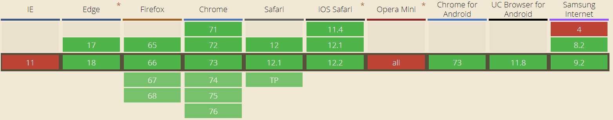

# async/await

>  Promise를 쉽게 사용하게 해주는 async/await에 대해 알아봅니다.

## JS의 비동기적 실행

자바스크립트는 비동기적으로 실행되기 때문에 우리가 예상하지 못한 작동이 일어날 수 있습니다.

```javascript
let first = 10
let second = 20

setTimeout(function() {
  console.log(first + second)
}, 500)

first = 20
```

이 파일의 실행 순서는

1. js 파일 실행
2. setTimeout 실행
3. first = 20 실행
4. 약 500ms 후 console.log(first + second) 실행

입니다. 따라서 console에 출력되는 값은 30이 아닌 40이 나오게 됩니다.

## JS를 동기적으로 실행하기

이를 동기적으로 실행하기 위한 방법은 크게 3가지가 있습니다.

1. Callback
2. Promise
3. async/await

이를 예시를 통해 알아보겠습니다. 예시를 위해 (비동기로 처리되는) goSchool 함수와 해당 함수 내에서 호출되는 wakeUp, takeBus, arrivePaldal 함수가 있다고 가정하겠습니다.

### 0. Naive

먼저 아무 방법도 쓰지 않은(비동기적으로 실행되는) JS 코드입니다. 

```javascript
function goSchool(time1, classStartTime){
    const time2 = wakeUp(time1)
    const time3 = takeBus(time2)
    const arrivalTime = arrivePaldal(time3)
    if(classStartTime < arrivalTime){
        youAreF()
    }
}
```

이 경우 코드가 정상적으로 실행되지 않을 확률이 높습니다. 이를 각각의 방법으로 고쳐보겠습니다.

*함수들이 해당 방법을 사용하기 위한 조건(인자, Promise 등) 을 충족한다고 가정하겠습니다.*

### 1. Callback

``` javascript
function goSchool(time1, classStartTime){
    wakeUp(time1, (time2) => {
        takeBus(time2, (time3) => {
            arrivePaldal(time3, (arrivalTime) => {
                if(classStartTime < arrivalTime){
                    youAreF()
                }
            })
        })
    })
}
```

구 버전의 JS에서도 사용가능하고, 한두개의 함수만 실행할때는 간단한 방법이지만, 위와 같이 여러개의 함수를 이어서 사용할 경우 'Callback Hell'이라 부르는 복잡한 콜백 형태가 만들어 질 수 있습니다.

callback을 남용하게 되면 가독성도 떨어지고, 콜백 함수에 대한 제어권은 호출되는 함수에게 넘어가기 때문에 찾기 어려운 오류가 발생할 가능성도 높습니다.

### 2. Promise

*promise에 대한 자세한 설명은 생략합니다.*

``` javascript
function goSchool(time1, classStartTime){
    return wakeUp(time1)
    	.then(time2 => takeBus(time2))
    	.then(time3 => arrivePaldal(time3))
    	.then(arrivalTime => {
        	if(classStartTime < arrivalTime){
                youAreF()
            }
    })
}
```

promise를 사용하면 이전의 callback 보다 확실히 간단한 것을 알 수 있습니다. 하지만 promise에 대한 이해가 필요하고, 아직 조금 복잡합니다. 우리가 C언어를 사용하는 것처럼 더 간단한 방법이 있으면 좋겠습니다.

### 3. async/await

``` javascript
async function goSchool(time1, classStartTime){
    const time2 = await wakeUp(time1)
    const time3 = await takeBus(time2)
    const arrivalTime = await arrivePaldal(time3)
    if(classStartTime < arrivalTime){
        youAreF()
    }
}
```

이전의 Promise보다 더 이해하기 쉽고 간단합니다. 이런 async/await에 대해 알아보겠습니다.

## async function 알아보기

### 사용법

`function` 앞에 `async` 를 붙여주고, 해당 함수 안에서 비동기로 처리되는 부분 앞에 `await`을 붙여주면 됩니다.

```javascript
async function goSchool(time1, classStartTime){
    const time2 = await wakeUp(time1)
    const time3 = await takeBus(time2)
    const arrivalTime = await arrivePaldal(time3)
    if(classStartTime < arrivalTime){
        youAreF()
    }
}
```

이 예제에서는 `goSchool` 을 async function 으로 선언하였으며, 함수 내부에서 `wakeUp`, `takeBus`, `arrivePaldal` 의 실행을 await으로 기다립니다.

이 함수가 실행되면 우리는 C언어에서처럼 wakeUp, takeBus, arrivePaldal이 차례차례 실행되고, if문이 실행되는것을 볼 수 있습니다.

### 내부 작동

async function은 해당 함수 내에 포함되어 있는 코드를 수행하는 비동기 함수를 나타내는 `AsyncFunction` 객체를 반환합니다.

이런 비동기 함수가 실행되면 결국 Promise를 반환합니다. 해당 함수가 Promise를 반환하지 않으면, 자동으로 Promise를 생성합니다.

await 또한 비동기 함수의 Promise를 받아서 반환하며, await 뒤의 함수에서 반환될 Promise가 fulfill 되거나 reject 되기까지 기다립니다. Promise가 아닐 경우 반환값을 `resolved promise` 로 변환시키고 기다립니다. 만약 Promise가 reject 될 경우, reject 된 값을 throw 합니다.  (일반적인 try catch 문으로 catch할 수 있습니다.)

## 결론

결국 async/await은 Promise를 쉽게 쓸 수 있는 방법을 제공한다고 할 수 있습니다. Promise에 대한 이해가 필요하긴 하지만, 코드 자체가 더 쉽고 직관적이기 때문에 좋은 코드를 만들기가 쉽습니다.

## TMI

* async function은 ES8 (ECMAScript 2017) 부터 정식 표준으로 포함되었습니다.(Node.js에서는 7.6.0부터 지원을 시작했습니다)

* async function은 IE를 제외한 대부분의 최신 브라우저에서 지원중입니다. 호환성을 신경쓴다면, Babel이나 Polyfill을 사용해야 합니다.

