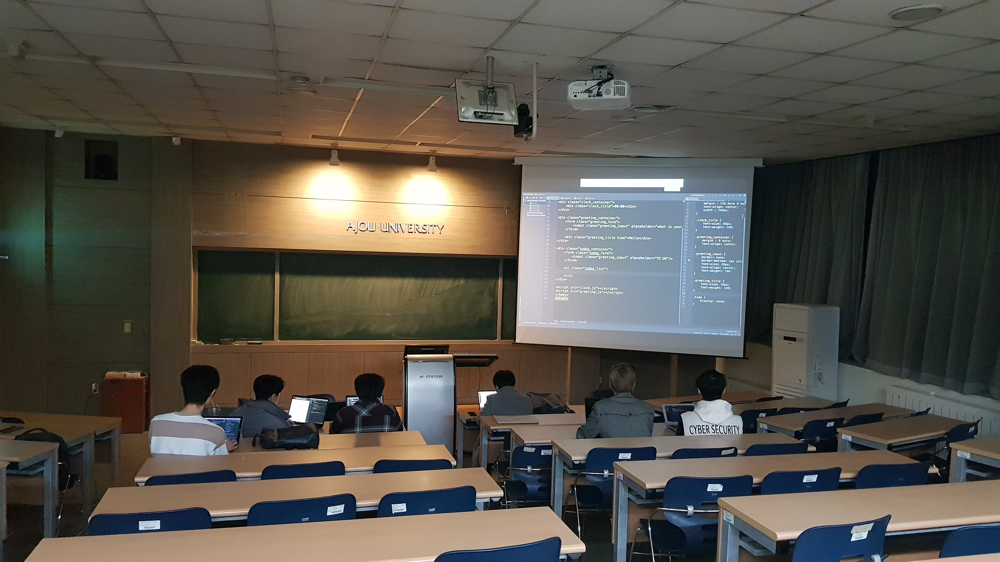
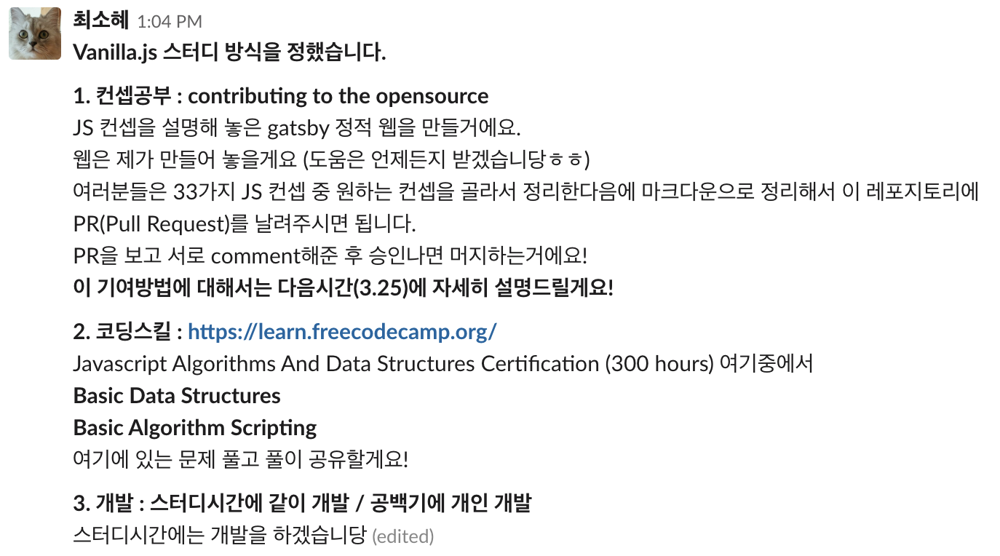

> Whois Javascript 스터디 보고 (2019년 3월 18일, 2019년  3월 25일), 2회 진행

#### 스터디 진행 정보

##### 진행 스터디

Javascript 스터디

##### 진행자

최소혜

##### 참여자 명단

강형국, 신상민, 여정수, 박재형, 이동영, 이주영, 이시훈

##### 진행장소 및 일자

1주차(2019.03.18) : 팔 309 / 2주차(2019.03.25) : 팔 110

​     

####  스터디 진행 내용

##### 1주차 : 2019.03.18

* Orientation
* 개발 스택 소개

> 1주차 스터디 자료
>
> https://github.com/purelledhand/whois-javascript/tree/master/WEEK1

##### 2주차 : 2019.03.25

* Free code camp 풀이 공유

* momentum 앱 개발 (clock + greeting)
* Todo 앱 개발

> 2주차 스터디 자료
>
> https://github.com/purelledhand/whois-javascript/tree/master/WEEK2

​	

#### 그외 진행 내용

1. **react static web site 개발**

   스터디 내용을 정리하기 위한 whois study repository를 개발

   https://study.ajou-whois.org

2. **Free Code Camp 문제 풀이**

3. **JS study 학습 방식 회의 및 확정**

4. **github을 이용한 코드 버전 관리 강의 및 포스팅**

5. **개인별 정리해서 올릴 JS 컨셉 선택**

6. **슬랙을 통한 스터디 관리**