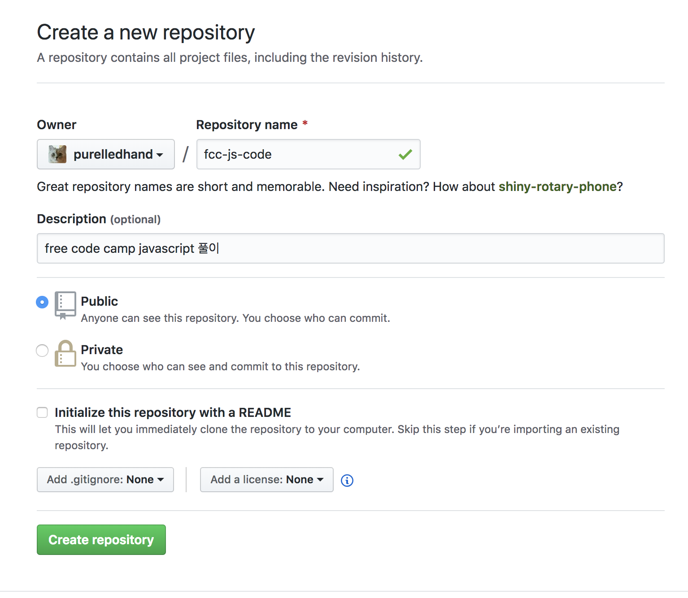
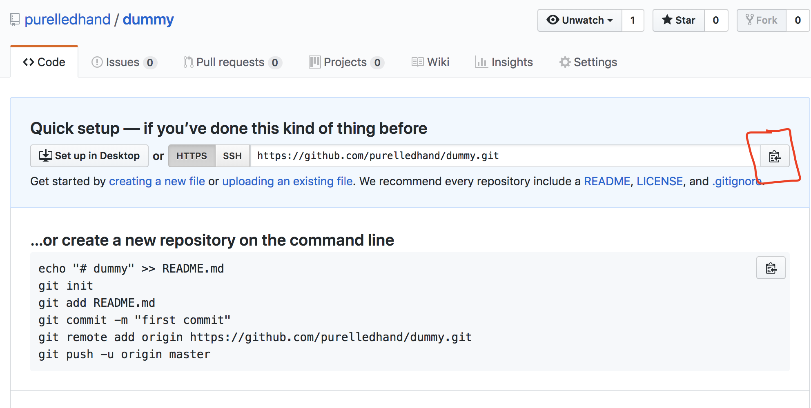
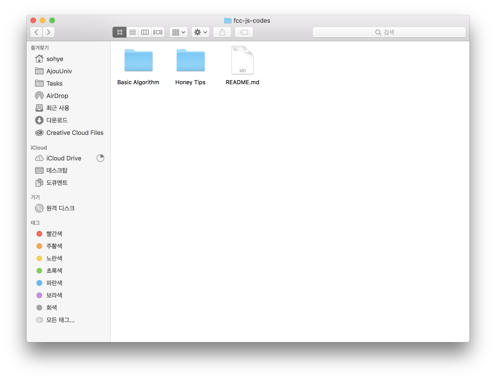
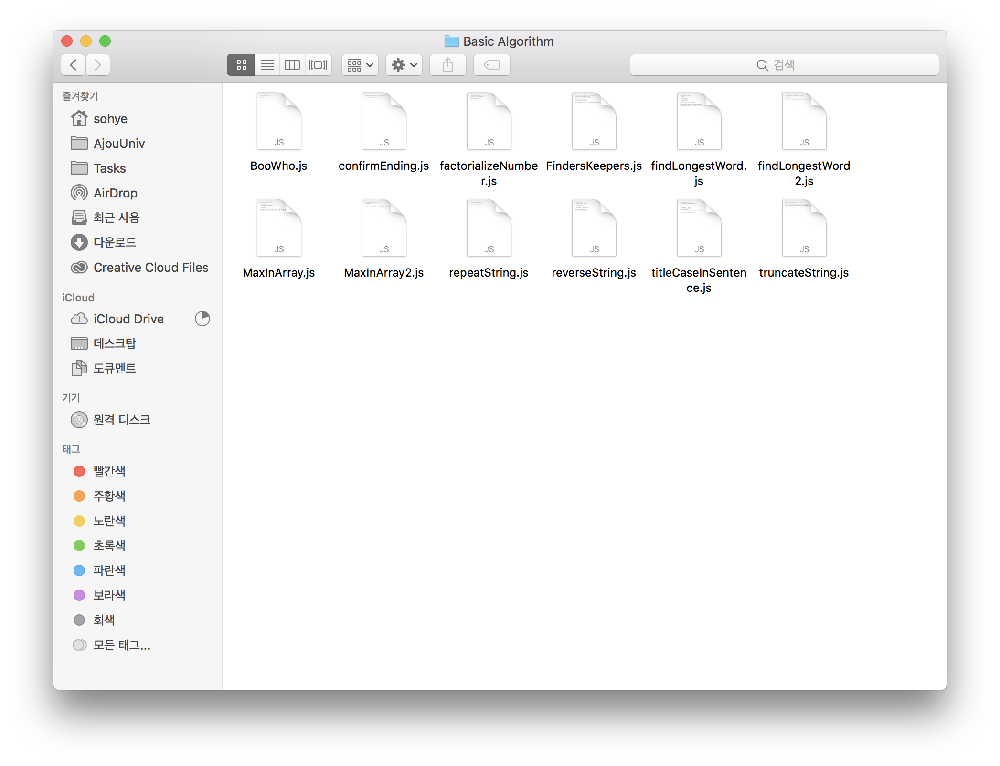
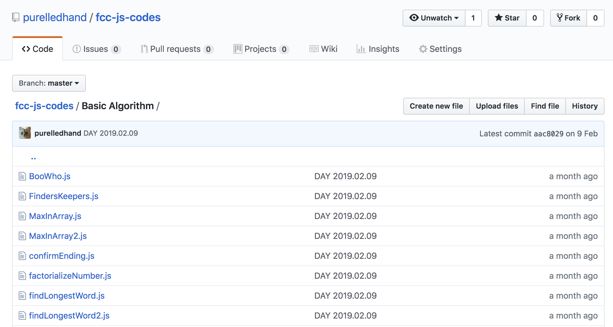

Javascript 스터디에서는 free code camp 풀이 공유, 개발 등의 목적으로 git을 이용하여 코드의 버전을 관리합니다. 

> 다음주 스터디(2019.03.25)까지 모두 free code camp 문제 풀이를 git에 올려야 하는데, 이 포스팅에서는 문제 풀이를 github에 올리는 과정에 대해 기록합니다.

#### Github 계정 만들기

https://github.com/

GitHub 계정이 없으신 분들은 계정을 만들어주세요. github.com/[username]이 여러분들의 github 공간이 됩니다.

#### Repository 생성

이제 코드를 관리할 저장소를 만들어야 합니다. 

https://gihub.com/[Username] 으로 들어가 repository 탭에서 new 버튼을 눌러 생성할 수 있습니다.

 

적당한 name과 description을 적어준 후 생성하면 **local(내 컴퓨터)이 아닌 remote(git origin)에 레포지토리가 생성됩니다.**

#### Repository 클론

방금 생성한 레포지토리는 아직 local에 존재하지 않고, remote에만 존재하기 때문에, 레포지토리를  local로 가져와서 코드의 버전을 관리해야 합니다. 이를 위해서 remote에 있는 repository를 local로 클론해와야 합니다.

> Gitkraken 툴로 git을 gui로 관리하면 매우 편하지만, 여기선 git-cli로 진행할게요.

Git-cli를 설치해주세요

* windows의 경우 링크 참고 https://coding-factory.tistory.com/245

repository를 클론해오면 repository가 디렉토리의 형태로 존재합니다. 따라서 원하는 경로에서 git terminal을 열어 아래 커맨드를 실행합니다.

```
git clone [repository 주소]
```

repository 주소는 https://github.com/[Username]/[repository name] 입니다.



새로 만든 레포지토리 페이지의 url을 복사하거나 위 스크린샷에서의 버튼을 눌러 레포지토리 주소를 복사할 수 있습니다.

#### 코드추가

생성된 레포지토리로 들어오면 비어있을거에요. 

Free code camp의 Javascript Algorithms And Data Structures Certification (300 hours) 커리큘럼에서 문제를 푼 코스별로 디렉토리를 만들고, js파일들은 해당 디렉토리에 저장해주시면 됩니다.



예를 들어 Basic Javascript코스에 있는 문제를 풀고싶다면, Basic Javascript 디렉토리를 만들고 그 안에 문제를 푼 js 파일을 올려 관리해주면 됩니다.



#### local에 있는 코드를 remote에 올리기

이제 내 컴퓨터에만 존재하는 코드들을 remote repository에 올려야 합니다. 

git terminal에서 아래 커맨드를 수행합니다.

```
git add *
git commit -m "이곳에는 커밋메세지를 적어주세요."
git push origin master
```


Repository 페이지에 아래 사진처럼 파일들이 remote에 올라왔다면 성공적으로 push된 것입니다!

